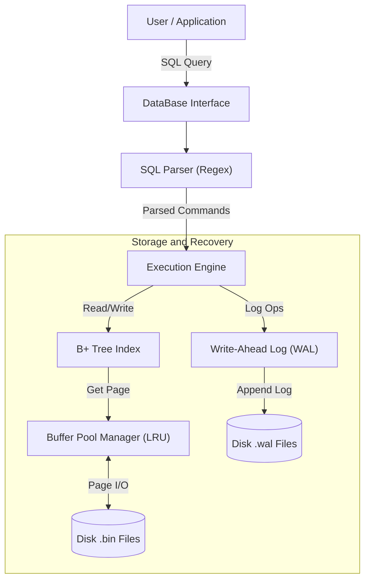

# MinilogDB: A C++ RDBMS with WAL-Based Recovery

MinilogDB is a lightweight, custom-built Relational Database Management System (RDBMS) written in C++17. It implements a complete database stack from scratch, including a regex-based SQL parser, a B+ Tree storage engine, a page-based Buffer Pool manager, and a robust Write-Ahead Logging (WAL) recovery system.

## 🚀 Key Features

- **SQL Support**: Handles `CREATE`, `INSERT`, `UPDATE`, `DELETE`, `SELECT` (including `WHERE` clauses and simple `JOIN`), and `DROP`.
- **Storage Engine**:
  - **B+ Tree Indexing**: Efficient data retrieval and range searches.
  - **Page-Based I/O**: Manages data in 4KB blocks (`DB_BLOCK_SIZE`).
  - **Buffer Pool**: LRU-based caching strategy to minimize disk I/O.
- **Crash Recovery (ARIES-style)**:
  - **Write-Ahead Logging (WAL)**: Ensures atomicity and durability.
  - **Checkpointing**: Periodically flushes dirty pages to reduce recovery time.
  - **Redo Logic**: Replays operations (`INSERT`/`UPDATE`) from logs upon restart after a crash.
- **Data Types**: Supports `INT`, `BIGINT` (Long Long), and `VARCHAR` (String).

---

## ⚖️ Architecture Overview



## 🛠 Build & Installation
### Prerequisites
* **C++ Compiler**: GCC or Clang supporting C++17.
* **CMake**: Version 3.20 or higher.
* **OS**: Linux/macOS (Recommended due to `unistd.h`, `sys/wait.h` usage in recovery tests) or Windows (MSVC).

### Compilation
```bash
# 1. Create a build directory
mkdir build && cd build

# 2. Generate Makefiles
cmake ..

# 3. Compile the project
make
```
This will generate two executables:
* `minilog_db`: The main interactive database shell.
* `test_recovery`: A test suite simulating a power-failure crash to verify WAL recovery.

## 💻 Usage Demo
Run the main program to enter the interactive SQL shell:
```bash
./minilog_db
```
### 1. Database Initialization
When prompted, enter a database name (e.g., `company_db`). If it doesn't exist, it will be created.
### 2. Creating Tables
Let's create a scenario with Departments and Employees.
```SQL
CREATE TABLE department(id INT PRIMARY KEY, dept_name VARCHAR(50), budget INT);

CREATE TABLE employee(emp_id INT PRIMARY KEY, name VARCHAR(50), age INT, salary INT, dept_name VARCHAR(50));
```
### 3. Inserting Data
```SQL
-- Insert Departments
INSERT INTO department (id, dept_name, budget) VALUES (1, 'Engineering', 1000000);
INSERT INTO department (id, dept_name, budget) VALUES (2, 'HR', 50000);

-- Insert Employees
INSERT INTO employee (emp_id, name, age, salary, dept_name) VALUES (101, 'Alice', 30, 90000, 'Engineering');
INSERT INTO employee (emp_id, name, age, salary, dept_name) VALUES (102, 'Bob', 28, 85000, 'Engineering');
INSERT INTO employee (emp_id, name, age, salary, dept_name) VALUES (103, 'Charlie', 35, 60000, 'HR');
```
### 4. Querying Data (SELECT & Filter)
Perform searches using `WHERE` clauses (supports `=`, `>`, `<`, `AND`, `OR`).
```SQL
-- Select all engineers
SELECT * FROM employee WHERE dept_name = 'Engineering';

-- Select high-salary employees older than 29
SELECT name, salary FROM employee WHERE salary > 80000 AND age > 29;

-- Select high-salary employees younger than 29
SELECT name, salary FROM employee WHERE salary > 80000 AND age < 29;
```
**Expected Output:**
```Plaintext
company_db->SELECT * FROM employee WHERE dept_name = 'Engineering';
|emp_id |name   |age    |salary |dept_name
|101    |Alice  |30     |90000  |Engineering
|102    |Bob    |28     |85000  |Engineering

company_db->SELECT name, salary FROM employee WHERE salary > 80000 AND age > 29;
|name   |salary
|Alice  |90000

company_db->SELECT name, salary FROM employee WHERE salary > 80000 AND age < 29;
|name   |salary
```
### 5. Updating Data
Modify existing records. The WAL ensures this operation is recoverable.
```SQL
-- Give Alice a raise
UPDATE employee SET salary = 95000 WHERE emp_id = 101;
```
**Expected Output:**
```Plaintext
company_db->UPDATE employee SET salary = 95000 WHERE emp_id = 101;
Updated 1 records

company_db->SELECT * FROM employee;
|emp_id |name   |age    |salary |dept_name
|101    |Alice  |30     |95000  |Engineering
|102    |Bob    |28     |85000  |Engineering
|103    |Charlie |35     |60000  |HR
```
### 6. Persistence Storage Test
Exit the database and run the program again, and then query data that has been inserted.

**Expected Output:**
```Plaintext
company_db->exit

./minilog_db
Please enter the database name to open or create: company_db
Found existing database 'company_db', loading data...
>>> Starting recovery for database: company_db
Found checkpoint at LSN: 88
Phase 1: Analysis (Scanning WAL...)
Phase 2: Redo - replaying 0 operations
Phase 3: Persistence - Flushing 0 pages to disk.
Recovery completed successfully.
Database [company_db] ready with recovery support.
Enter SQL commands or 'exit' to quit.
Enter 'checkpoint' to create a recovery checkpoint.

company_db->SELECT * FROM employee;
|emp_id |name   |age    |salary |dept_name
|101    |Alice  |30     |95000  |Engineering
|102    |Bob    |28     |85000  |Engineering
|103    |Charlie |35     |60000  |HR
```

### 7. Join Operations
MinilogDB supports Nested-Loop Joins to combine data from two tables.
```SQL
-- Find employees and their department budgets
SELECT name, budget FROM employee JOIN department WHERE employee.dept_name = department.dept_name;
```
```Plaintext
company_db->SELECT name, budget FROM employee JOIN department WHERE employee.dept_name = department.dept_name;
|name   |budget
|Alice  |1000000
|Bob    |1000000
|Charlie   |50000
```
### 8. Deleting Data & Dropping Tables
```SQL
-- Remove Bob
DELETE FROM employee WHERE name = 'Bob';

-- Drop the HR table
DROP TABLE department;
```
```Plaintext
company_db->DELETE FROM employee WHERE name = 'Bob';
Delete successful

company_db->SELECT * FROM employee;
|emp_id |name   |age    |salary |dept_name
|101    |Alice  |30     |95000  |Engineering
|103    |Charlie        |35     |60000  |HR

company_db->SHOW
Tables in database [company_db]:
--- Table: department ---
|id     |dept_name      |budget
--- Table: employee ---
|emp_id |name   |age    |salary |dept_name

company_db->DROP TABLE department;
Delete successful

company_db->SHOW
Tables in database [company_db]:
--- Table: employee ---
|emp_id |name   |age    |salary |dept_name
```
## 🔄 Crash Recovery Feature
One of the strongest features of MinilogDB is its resilience to crashes.

**How it works**
1. Modifications (Insert/Update/Delete) are first written to a `.wal` file.
2. Dirty Pages in the buffer pool are lazily flushed to the `.bin` disk files.
3. If the program crashes before the Buffer Pool flushes, the `.bin` file is inconsistent.
4. On Restart: The `RecoveryManager` reads the WAL, finds the last Checkpoint, and "Redoes" any missing operations to restore the database state.

**Running the Recovery Simulation**
The project includes a dedicated test executable (`test_recovery`) that uses `fork()` and `_Exit(0)` to simulate a sudden process death.
```bash
./test_recovery
```
**Expected Output:**
```Plaintext
[CrashProcess] Inserting data id=1, id=2...
[CrashProcess] >>> Executing Checkpoint <<<
[CrashProcess] Inserting data id=3 (After Checkpoint)...
[CrashProcess] Updating data id=1 -> val=999...
[CrashProcess] Simulating power failure crash...
...
[VerifyProcess] Initializing RecoveryManager (Automatically executing Redo)...
[VerifyProcess] Phase 1: Analysis...
[VerifyProcess] Phase 2: Redo - replaying operations...
[VerifyProcess] Verifying data consistency...
[Passed] Data before Checkpoint (id=2): id=2, val=200
[Passed] Insert after Checkpoint (id=3): id=3, val=300
[Passed] Update after Checkpoint (id=1): id=1, val=999
```
## 📂 Project Structure
- `BPTree.cpp/h`: Implementation of the B+ Tree data structure for indexing and data storage.

- `BufferPool.cpp/h`: Manages memory pages, implementing LRU eviction and disk R/W.

- `rwdata.cpp/h`: FileManager class that handles low-level block reading/writing and bit-maps.

- `WAL.cpp/h`: Write-Ahead Logging logic and the RecoveryManager.

- `sqlparser.cpp/h`: Regex-based parser to interpret user SQL strings.

- `DataBase.cpp/h`: Main controller class linking the Parser, B+ Tree, and Recovery modules.

- `main.cpp`: Entry point for the CLI application.

- `test_recovery.cpp`: Test harness for crash recovery verification.

## 🔮 Future Improvements
- **Concurrency Control (Isolation)**: Currently, the system is designed for single-threaded execution. Future work includes implementing a **Lock Manager** (using Two-Phase Locking) or **MVCC** (Multi-Version Concurrency Control) to ensure thread safety and isolation levels (e.g., Serializable, Read Committed) during concurrent access.

- **Explicit Transaction Support (Atomicity)**: Although the WAL module supports `logCommit` and `logAbort` internally, the SQL parser does not yet expose these to the user. Future updates will add support for `BEGIN TRANSACTION`, `COMMIT`, and `ROLLBACK` commands to allow multi-statement atomic transactions.

- **Enhanced Integrity Constraints (Consistency)**: Extend the storage engine to strictly enforce Foreign Key constraints (e.g., cascading deletes/updates) and add support for `NOT NULL` and `UNIQUE` constraints beyond the primary key.

- **Query Optimization**: Add a query planner to optimize Join orders and index usage.

- **Complex SQL**: Support nested queries, aggregations (`COUNT`, `SUM`), and sorting (`ORDER BY`).


